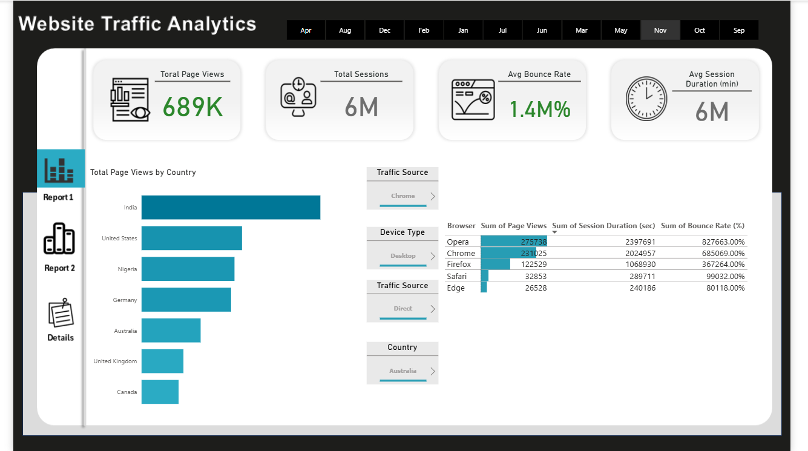
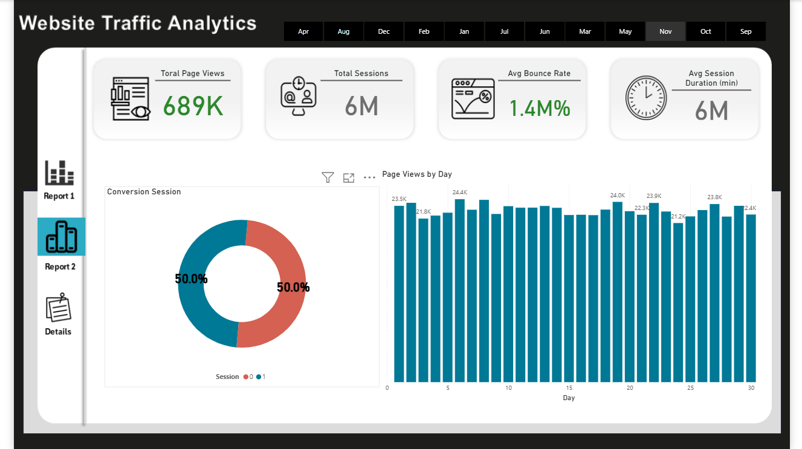

# 🌐 Website Traffic Analytics Dashboard - Power BI Project

## 🎯 Project Objective

The objective of this Power BI dashboard is to provide comprehensive and interactive insights into website traffic behavior to help digital marketers, product managers, and analysts:

- Track user activity by browser, device, country, and traffic source.
- Understand bounce rates, session duration, and daily engagement patterns.
- Identify peak traffic days and conversion session rates.
- Optimize user experience and marketing campaigns using data insights.

---
## Dataset 
Link: https://www.kaggle.com/datasets/anthonytherrien/website-traffic

## 📘 Project Description

This project visualizes website analytics data in an interactive Power BI dashboard. It includes two report pages:

1. **Report 1: Country, Browser & Device Overview**
2. **Report 2: Conversion Sessions & Daily Page Views**

The dashboard helps stakeholders quickly assess web performance metrics and take action based on real-time patterns and visitor behaviors.

---

## 📊 Key Metrics Tracked

| **Metric**              | **Description**                                                                 |
|-------------------------|----------------------------------------------------------------------------------|
| Total Page Views        | Total number of pages viewed by users across all sessions.                      |
| Total Sessions          | Total number of unique visits.                                                  |
| Avg Bounce Rate (%)     | Percentage of visitors who left the site without any interaction.               |
| Avg Session Duration    | Average time spent on the website per session.                                  |
| Conversion Sessions     | Proportion of sessions that resulted in a conversion.                           |
| Page Views by Country   | Top countries by traffic volume (e.g., India, US, Nigeria, etc.).               |
| Traffic Source          | Source of incoming traffic (e.g., Chrome, Direct, Referral).                    |
| Device Type             | Whether users visited from desktop, mobile, etc.                                |
| Browser Comparison      | Page views and bounce rate breakdown by browser (e.g., Opera, Chrome, Firefox). |
| Page Views by Day       | Daily traffic trends over a month.                                              |

---

## 📊 Dashboard Preview

### 🧾 Report 1 – Country, Browser, Device Overview

- **Bar Chart**: Total Page Views by Country
- **Table**: Browser-wise session duration and bounce rate
- **Filters**: Device Type, Country, and Traffic Source

---

### 📊 Report 2 – Conversion & Daily Traffic Analysis

- **Donut Chart**: Conversion Sessions Distribution
- **Bar Chart**: Page Views by Day
- **Top Cards**: Key metrics including Total Page Views, Bounce Rate, and Avg Session Duration

---

## 🛠️ Tools & Technologies Used

- **Power BI** – For building interactive dashboards
- **Power Query** – For data cleaning and shaping
- **DAX (Data Analysis Expressions)** – To calculate measures like bounce rate, average session time, etc.
- **CSV / Web Log Data** – Used as input dataset

---

## 🔍 Key Insights

- **India** is the leading country in terms of traffic volume.
- **Opera** browser users spent more time on site but had a high bounce rate.
- Sessions are equally split between two conversion types (50%-50%).
- Traffic remains consistent across most days with minor peaks around the 10th and 20th of the month.
- **Bounce rate** is relatively low at around **1.4M%**, suggesting strong engagement.

---

